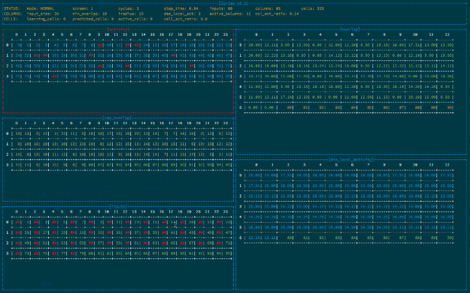

# Cursed

Cursed is a curses based window manager for displaying large amounts of tabular data.

## Screenshots



## Installation

Add this line to your application's Gemfile:

    gem 'cursed'

And then execute:

    $ bundle

Or install it yourself as:

    $ gem install cursed

## Default Keybindings

```
# Normal Mode
h   - left
j   - down
k   - up
l   - right
H   - scroll left
J   - scroll down
K   - scroll up
L   - scroll right
D   - scroll down 10
U   - scroll up 10
x   - hide instrument
X   - hide panel
m   - show menu
n   - next screen
p   - prev screen
[s] - step simulation
f   - step simulation 10 times
F   - step simulation 100 times
b   - break
q   - exit

# Menu Mode
m        - hide menu
(0-9)    - show instrument (0-9)
^(0-9) - show panel (0-9)

# Legend
[s] - spacebar
^   - shift
```

## Usage

Cursed uses a config hash to setup the layout, custom keybindings, and header info, as
well as to interface with an external data source.

```ruby
TODO: example
```

## Contributing

This release is very very beta. There are bugs. There are no tests. Stuff may
break. If you have an idea for how to fix it, follow directions below...

1. Fork it
2. Create your feature branch (`git checkout -b my-new-feature`)
3. Commit your changes (`git commit -am 'Add some feature'`)
4. Push to the branch (`git push origin my-new-feature`)
5. Create new Pull Request
